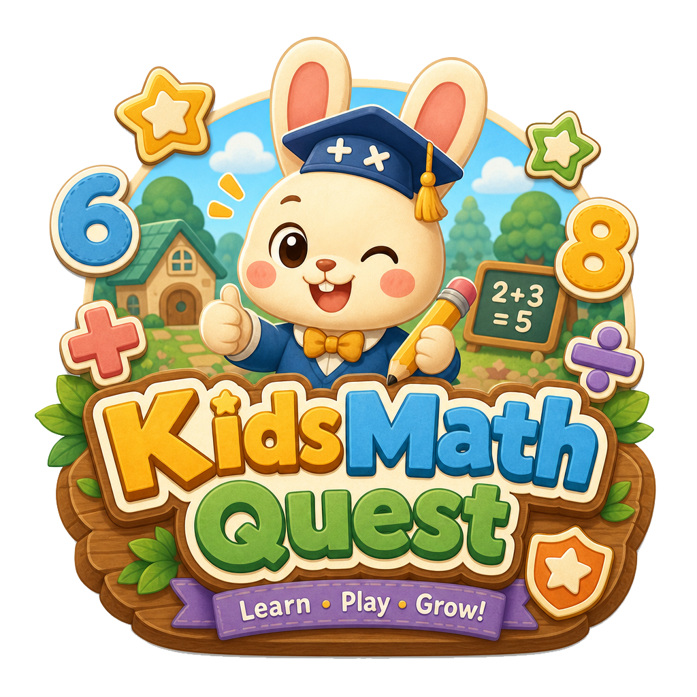

# KidsMathQuest

<div align="center">



**一个给小学生练习加减乘除的web应用，可以定制化自动生成计算题练习。顺便靠AI把前端做的好看点，就是为了能让孩子能每天多练几题……**


</div>


## 快速开始
```bash
cp .env.example .env

# 后端
cd backend
npm install
npx prisma db push   # 第一次拉代码后先执行，创建 SQLite 文件和表结构
npm run dev

# 前端
cd ../frontend
npm install
npm run dev

# 访问应用
# 家长端登录：http://localhost:3000/login
# 儿童端登录：http://localhost:3000/child-login
# 后端 API：http://localhost:5000
```